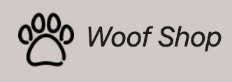

# 모두의 반려동물을 위한

👉 https://sookheewoof.shop/

저처럼 반려동물을 가족처럼 생각하시는분들도 많이 계실 겁니다. 이 웹사이트는 애완동물 용품만 을 사고 파는 곳일 뿐만 아니라 애완동물을 키우는 사람들과 지식을 공유하고 소통할수있는 곳입니다 🐶
 

마이페이지, 마켓페이지, 마이카트는 로그인 이후 이용 가능합니다   
<b>직접 회원가입 하셔서 테스트 해보실수 있지만, "admin" 이라는 계정으로 바로 로그인 할 수 있도록 설정되어있습니다!</b>

<li>홈 (랜딩페이지)</li>
<li>마이 페이지</li>
<li>마켓 페이지</li>
<li>게시물 페이지</li>

#

- 마이 페이지

  - 로그인 정보 수정
  - 내가 찜한 상품 조회
  - 내가 구매한 상품 목록 조회
  - 내가 판매한 상품 목록 조회
  - 아임포트 결제 구현으로 포인트 충전

- 마켓 페이지

  - 목록 무한스크롤 버튼으로 조회
  - 목록 검색 기능
  - 카카오 지도 API
  - 찜하기 기능 구현
  - 나만의 카트 기능 구현
  - 상세페이지 및 댓글 기능 구현 (작성, 수정, 삭제)

- 게시물 페이지

  - 베스트 게시물 그리고 일반 게시물 등록 및 조회
  - 게시물 검색 기능
  - 이미지 업로드, 유튜브 불러오기 기능
  - 댓글 수정 그리고 삭제 기능
  - 좋아요 기능

#

백엔드는 코드캠프측에서 자체 제공해주셨습니다

#

\*개인 포트폴리오는 계속 리팩토링 진행 중입니다!\*
